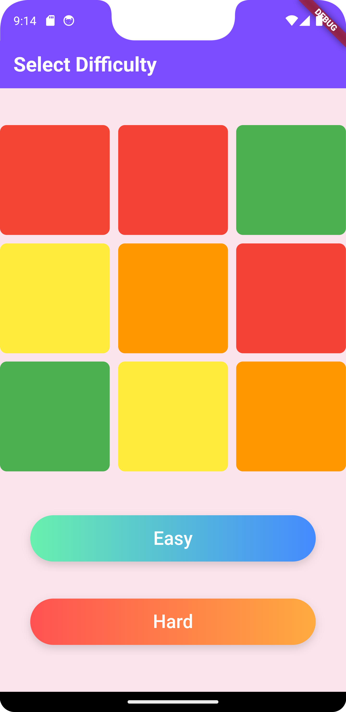
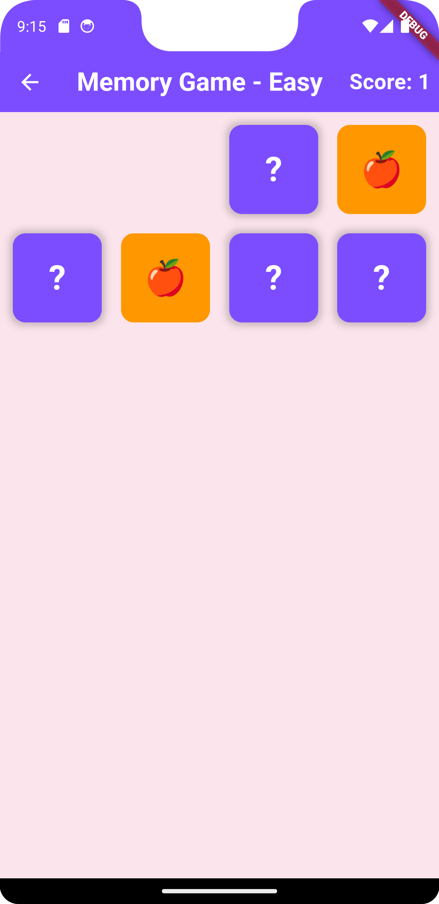

# Memory Game

Memory Game is a playful and engaging app built with Flutter that challenges your memory with a colorful and fun interface.

## Features

- Two difficulty levels: Easy and Hard
- Animated grid for an immersive user experience
- Fun card flipping mechanics using the `flip_card` package
- Dynamic scoring system with a high score tracker
- Playful UI with vibrant colors and a Comic-style font

## Screenshots

Here are some screenshots of the Memory Game app:

### Start Screen


### Gameplay


### Win Dialog


## Getting Started

To run this app locally:

1. Clone the repository:
   ```bash
   git clone https://github.com/your-username/memory-game.git
   ```
2. Navigate to the project directory:
   ```bash
   cd memory-game
   ```
3. Install dependencies:
   ```bash
   flutter pub get
   ```
4. Run the app:
   ```bash
   flutter run
   ```

## Dependencies

- `flip_card` package for card flipping animations
- `flutter` for building the app

## Created By

This project was created by [CodēCodes](https://www.cod-e-codes.com/).

- Website: [CodēCodes](https://www.cod-e-codes.com/)
- GitHub: [Cod-e-Codes](https://github.com/Cod-e-Codes/)
